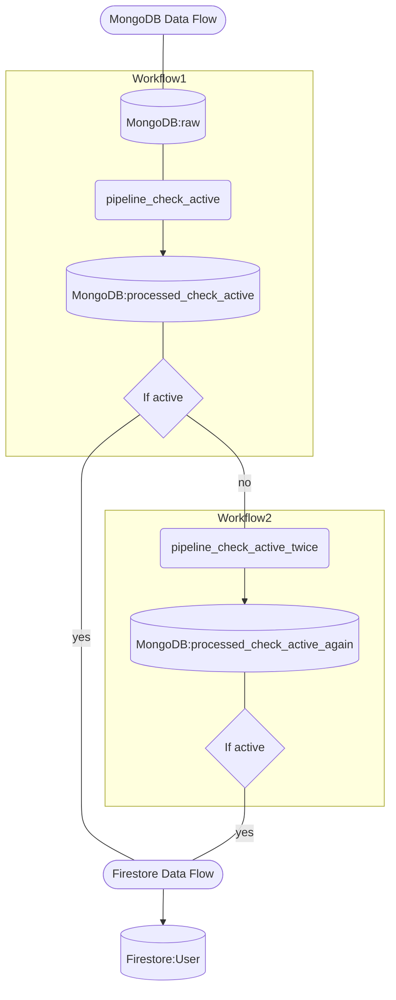

Work Phase 1

```mermaid
flowchart TD
    %% Component
        DataFlowMongo([MongoDB Data Flow])
        DataFlowFirestore([Firestore Data Flow])

        DbMongoRaw[(MongoDB:raw)]
        DbMongoProcessed1[(MongoDB:processed_check_active)]
        DbMongoProcessed2[(MongoDB:processed_check_active_again)]
        DbFirestoreUser[(Firestore:User)]

        CheckPoint1{If active}
        CheckPoint2{If active}

        PipelineProcessor1(pipeline_check_active)
        PipelineProcessor2(pipeline_check_active_twice)

        Workflow1[Workflow 1]
        Workflow1[Workflow 2]


    %% Flow
        DataFlowMongo---DbMongoRaw

        %% 1st day every week
        subgraph Workflow1
            DbMongoRaw

            ---PipelineProcessor1
            -->DbMongoProcessed1

            --- CheckPoint1
        end

        %% 2nd day every week
        subgraph Workflow2

            CheckPoint1-- no

            ---PipelineProcessor2
            -->DbMongoProcessed2

            ---CheckPoint2
        end

        CheckPoint1 -- yes ---DataFlowFirestore
        CheckPoint2 -- yes ---DataFlowFirestore
        DataFlowFirestore--> DbFirestoreUser

```
